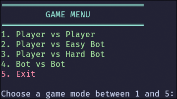
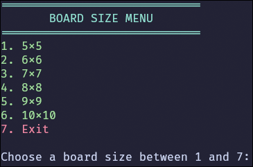
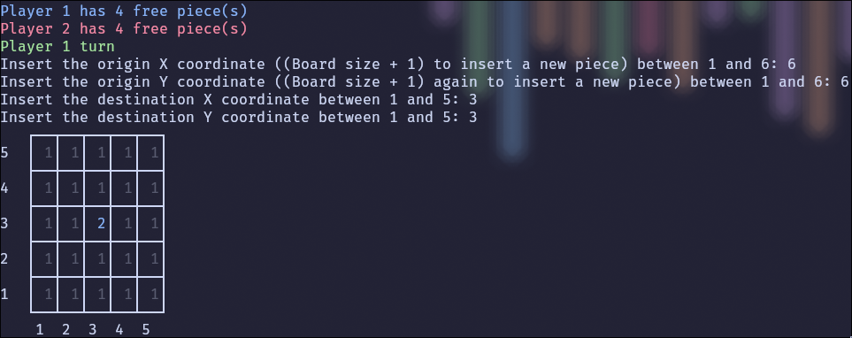
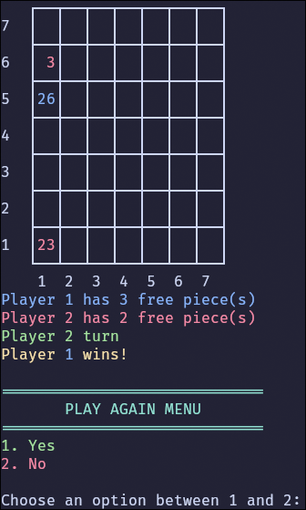

# STAQS01 - T01

## Member Contribution

- Henrique Sardo Fernandes, 202204988 (50%):

  - Interface / Menu
  - Game logic and move validation

- Filipe Gonçalves Neves Gaio, 202204985 (50%):
  - Bots
  - Game logic and game over detection

> The project was developed in pair programming, with both members contributing to all parts of the project, but with a focus on the parts mentioned above.

## Installation and Execution

### Linux

1. Install SICStus Prolog 4.9. (https://sicstus.sics.se/)
2. Open a terminal and navigate to the project's directory.
3. Open SICStus Prolog with the command `sicstus`.
4. Load the project with `consult('game.pl').`.
5. Start the game with `play.`.

### Windows

1. Install SICStus Prolog 4.9. (https://sicstus.sics.se/)
2. Open PowerShell and navigate to the project's directory.
> The regular SICStus GUI (the one with the white background) is not recommended due to the lack of color support.
3. Open SICStus Prolog with the command `sicstus`.
4. Load the project with `consult('game.pl').`.
5. Start the game with `play.`.

## Description of the game

> Game description taken from [here](https://boardgamegeek.com/boardgame/425529/staqs)

**STAQS** is a strategic two-player board game played on a 5x5 grid. Each player has four stackable pieces of their color (blue or white), which they place and move on top of 25 neutral stackable pieces. Players take turns moving their stacks one step at a time, aiming to create the tallest stack on the board. The game combines elements of territory control and vertical stacking, challenging players to outmaneuver their opponent through clever positioning and stack building. The game ends when no more moves are possible, and victory goes to the player who controls the tallest stack, with tiebreakers based on the number and height of secondary stacks.

**Overview**

STAQS is a two-player game played on a 5x5 grid. The goal is to own the tallest stack when there are no moves left.

**Components**

- 25 stackable neutral pieces
- 4 blue stackable pieces
- 4 white stackable pieces

**Setup**

1. Arrange the 25 neutral pieces into a 5x5 grid.
2. Players choose a color (blue or white).
3. Starting with blue, players alternate placing one of their pieces on top of a neutral piece.

**Gameplay**

1. On your turn, move one of your stacks (including any neutral pieces in the stack) one step onto another neutral piece.
2. Stacks cannot jump over other stacks or move over empty spaces.
3. If a player is unable to move, they must pass.
4. If both players pass consecutively, the game ends.

**Winning**
The winner is determined in the following order:

1. The player with the tallest stack wins.
2. If players have stacks of equal height (n), the player with the most stacks of height n wins.
3. If still tied, compare the next tallest stacks or most stacks of equal height until a winner is determined.

## Considerations for game extensions

Variable board sizes are supported, featuring a dynamic print board function that adapts to the board's size.

We also implemented 3 puzzles, that are meant to challenge the player to find the best sequence of moves in a given situation.

## Game Logic

### Game Configuration Representation

The initial game configuration is represented by a list of 2 elements. The first element is the size of the board, and the second is the level. 

```prolog
GameConfig = [BoardSize, Level]
```
The level can be `1` for Human vs Human, `2` for Human vs Easy Bot, `3` for Bot vs Hard Bot and `4` for Bot vs Bot.


### Internal Game State Representation

The internal game state is represented by a list of 5 elements. The first element is the board, the second is the current player, the third is the level, the fourth is the free pieces (pieces that have not been placed yet) for player 1 and the fifth is the free pieces for player 2. 

```prolog
GameState = [Board, Player, Level, Player1FreePieces, Player2FreePieces]
```

The board is a 2D matrix, where each element can be:
- `blank` for a piece that does not belong to any player
- a positive value for a piece that belongs to player 1
- a negative value for a piece that belongs to player 2
- `none` for an empty space

An initial game state is represented as follows:

```prolog
Board = [[blank, blank, blank, blank, blank],
         [blank, blank, blank, blank, blank],
         [blank, blank, blank, blank, blank],
         [blank, blank, blank, blank, blank],
         [blank, blank, blank, blank, blank]]
GameState = [Board, 1, 1, 4, 4]
```

During the game, a possible game state could be:

```prolog
Board = [[blank, none, 3, blank, blank],
         [blank, blank, blank, blank, blank],
         [blank, -2, blank, 2, blank],
         [blank, blank, blank, 2, blank],
         [blank, blank, none, none, -4]]
GameState = [Board, 1, 1, 2, 1]
```

At the end of the game, the board could be:

```prolog
Board = [[-12, none, none, none, none],
         [12, none, none, none, none],
         [-2, none, none, none, none],
         [2, none, none, none, none],
         [-2, none, none, none, none]]
GameState = [Board, 1, 1, 2, 1]
```

### Move Representation

A move is represented by 4 elements. The two elements correspond to the initial position, and the other two correspond to the final position.

The coordinates start at 1,1 in the bottom left corner of the board, and a coordinate of (BoardSize+1, BoardSize+1) represent a free piece (a piece that has not been placed yet).

Some examples of moves are:
```prolog
move(6,6,1,1) % Move a free piece to the bottom left corner
move(1,1,1,2) % Move a stack from the bottom left corner to the right
```

### User Interaction

The game is played in the terminal, with the board being printed in color. The player can select the stack to move by inputting the initial and final coordinates. The game also features a menu where the player can select the game mode and the size of the board.

Input validation is done when the player inserts each number, by giving a range of valid numbers. Furthermore, the game also validates if the move is valid, by checking if the coordinates are valid and if the move is possible.

<figure align="center">
  
  <figcaption>Menu</figcaption>
</figure>

<figure align="center">
  
  <figcaption>Board size menu</figcaption>
</figure>

<figure align="center">
  
  <figcaption>Move</figcaption>
</figure>

<figure align="center">
  
  <figcaption>Board</figcaption>
</figure>


## Conclusions

### Known Issues

- If the board is too large, it may exceed the terminal size
- If there is a STAQ with more than 100 elements, the board may not be printed correctly.

### Possible Improvements

- A third bot, featuring a Minimax algorithm with alpha-beta pruning.
- Support for more than two players.
- Better controls, such as using <kbd>WASD</kbd> to select the stack to move.

## Bibliography

- [STAQS - BoardGameGeek](https://boardgamegeek.com/boardgame/425529/staqs)
- [SICStus Documentation](https://sicstus.sics.se/sicstus/docs/latest4/html/sicstus.html/)
- [Prolog Workshop Slides by Fábio Sá](https://slides.niaefeup.pt/prolog-workshop/#1)
- Occasional use of ChatGPT and Copilot for finding errors in the code.


